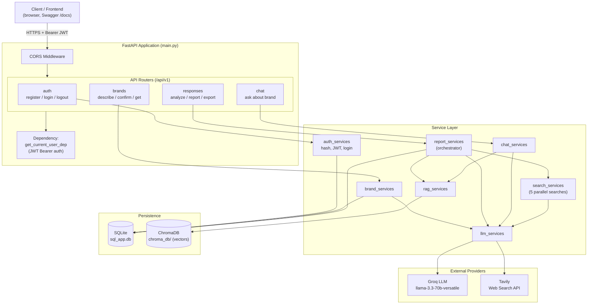
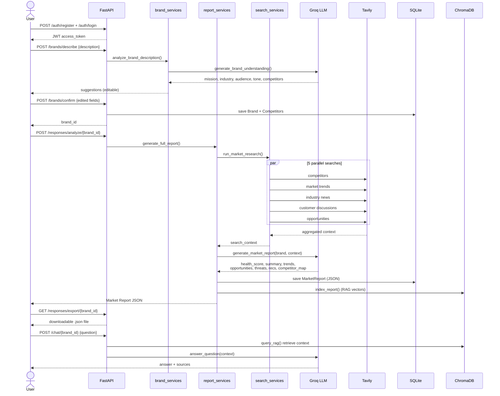
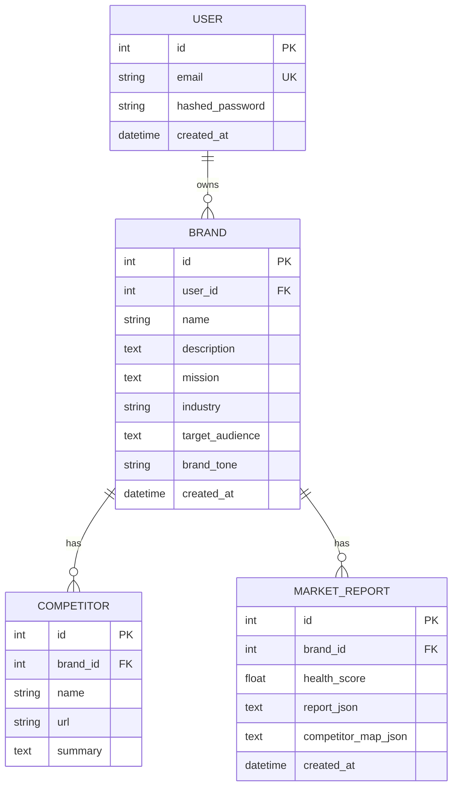

# Market Research API — System Design

## 1. High-Level Architecture



## 2. Core User Flow — "Analyze Market" Pipeline



## 3. Database Schema (ER Diagram)



## 4. API Endpoints

| Method | Path | Auth | Description |
|--------|------|------|-------------|
| POST | `/api/v1/auth/register` | No | Create user, return JWT |
| POST | `/api/v1/auth/login` | No | Login, return JWT |
| POST | `/api/v1/auth/logout` | No | Stateless logout |
| POST | `/api/v1/brands/describe` | Yes | LLM suggests mission/industry/audience/tone/competitors |
| POST | `/api/v1/brands/confirm` | Yes | Save (edited) brand + competitors |
| GET | `/api/v1/brands/{brand_id}` | Yes | Fetch a brand |
| POST | `/api/v1/responses/analyze/{brand_id}` | Yes | Run full research pipeline |
| GET | `/api/v1/responses/report/{brand_id}` | Yes | Get latest saved report |
| GET | `/api/v1/responses/export/{brand_id}` | Yes | Download report as JSON file |
| POST | `/api/v1/chat/{brand_id}` | Yes | RAG-powered Q&A on report |

## 5. Technology Stack

| Layer | Technology |
|-------|-----------|
| Web framework | FastAPI + Uvicorn |
| Auth | JWT (python-jose) + bcrypt |
| ORM / DB | SQLAlchemy + SQLite |
| LLM | Groq `llama-3.3-70b-versatile` |
| Web search | Tavily API |
| Vector store / RAG | ChromaDB (persistent) |
| Validation | Pydantic v2 |

## 6. Component Responsibilities

- **Routers** (`app/api/v1`): HTTP layer, request/response validation, auth dependency.
- **Services** (`app/services`): business logic; keep routers thin.
  - `report_services` is the orchestrator: search -> LLM -> DB -> RAG index.
  - `llm_services` is the single integration point for Groq + Tavily.
  - `rag_services` wraps ChromaDB (index + query).
- **Models** (`app/models`): SQLAlchemy tables (all imported in `__init__.py`).
- **Schemas** (`app/schemas`): Pydantic request/response contracts.
- **Core** (`app/core`): config, database session, security, dependencies.
```
